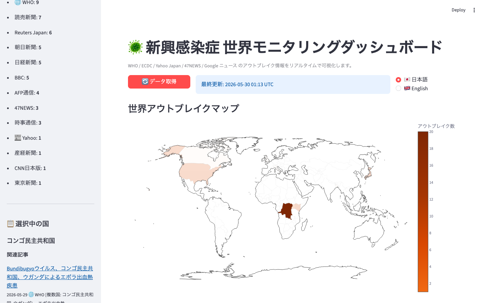

[English](README.md) | 日本語

# 新興感染症 世界モニタリングダッシュボード

**ステータス**: 安定運用中(v1.0)。主要機能は実装完了し、現在は一区切り。以降はメンテナンス(データソース保守・バグ修正)が中心です。

WHO / ECDC のアウトブレイク情報と日本語ニュースを、インタラクティブな世界コロプレスマップでリアルタイム可視化する Streamlit アプリです。



## 主な機能

- **5データソース**を並列取得: WHO DON、ECDC CDTR、Yahoo ニュース Japan、Google ニュース、NHK (Google ニュース経由で 47NEWS・全国紙・通信社を集約)
- **インタラクティブ世界地図** — 国をクリックするとサイドバーに関連記事を表示
- **疾患フィルタ** — エボラ、麻疹、デング熱、ハンタウイルス、エムポックス、サイクロスポラ症など19疾患
- **配信元ホワイトリスト** — 公共放送・全国紙・通信社・公的機関のみ
- **国名抽出** — 表記揺れ辞書(80カ国以上)、複数国対応、広域・不明セクション
- **日英相互翻訳** — argos-translate による完全ローカル翻訳(APIキー不要)

## データソース

| ソース | 内容 |
|--------|------|
| [WHO Disease Outbreak News (DON)](https://www.who.int/emergencies/disease-outbreak-news) | WHO が公表する感染症アウトブレイク速報 |
| [ECDC CDTR](https://www.ecdc.europa.eu/en/publications-and-data/monitoring/weekly-threats-reports) | 欧州疾病予防管理センターの週次レポート |
| [Yahoo Japan トピックス](https://news.yahoo.co.jp/) | Yahoo Japan 主要・国際トピックス RSS |
| [Google ニュース](https://news.google.com/) | 疾患キーワードによる Google News RSS(ホワイトリスト済み — 47NEWS・全国紙・通信社を含む) |

## 技術スタック

| | |
|---|---|
| **言語** | Python 3.11+ |
| **UI** | [Streamlit](https://streamlit.io/) |
| **地図** | [Plotly](https://plotly.com/python/) コロプレスマップ |
| **パッケージ管理** | [uv](https://docs.astral.sh/uv/) |
| **翻訳** | [argos-translate](https://github.com/argosopentech/argos-translate)(完全ローカル) |
| **国名解決** | [pycountry](https://pypi.org/project/pycountry/) |
| **フィード解析** | [feedparser](https://pypi.org/project/feedparser/) |
| **HTML解析** | [BeautifulSoup4](https://pypi.org/project/beautifulsoup4/) |

## 動作環境

| プラットフォーム | アプリ本体 | 翻訳機能 |
|---|---|---|
| Apple Silicon Mac (M1/M2/M3/M4) | ✅ | ✅ |
| Intel Mac (x86_64) | ✅ | ❌ 非対応 |
| Windows (x86_64 / ARM64) | ✅ | ✅ |
| Linux (x86_64 / ARM64) | ✅ | ✅ |

- アプリの中核機能(世界地図・データ取得・疾患フィルタ・記事表示など)は全プラットフォームで動作します。
- 日英翻訳機能は、翻訳ライブラリ(argos-translate)が依存する onnxruntime が Intel Mac 向けのパッケージを提供していないため、**Intel Mac では利用できません**。Intel Mac では翻訳以外の機能をご利用ください。
- Apple Silicon Mac、Windows、Linux では全機能が利用可能です。

## セットアップ

### 前提条件

- Python 3.11 以上
- [uv](https://docs.astral.sh/uv/)（パッケージマネージャ）

### インストール

```bash
# リポジトリのクローン
git clone <repository-url>
cd infectious-disease-monitor
```

翻訳機能を使う場合(Apple Silicon Mac / Windows / Linux):

```bash
uv sync --extra translation
```

翻訳機能なし(Intel Mac、または翻訳が不要な場合):

```bash
uv sync
```

### 実行

```bash
uv run streamlit run app.py
```

ブラウザで `http://localhost:8501` が開きます。初回起動時はアウトブレイクデータを自動取得します。

> **注意:** `--extra translation` でインストールした場合、初回起動時に argos-translate の日英翻訳モデル(各 ~50 MB)もダウンロードされます。ネット接続が必要なのはこの1回のみで、以降は完全オフラインで動作します。翻訳機能なしの場合は、UIの言語切替は利用できますが記事タイトルは原文表示になります。

## ディレクトリ構造

```
.
├── app.py                      # Streamlit エントリーポイント
├── src/
│   ├── fetchers/               # データ取得(WHO / ECDC / Yahoo / Google)
│   ├── parsers/                # 国名抽出・疾患フィルタ・配信元ホワイトリスト
│   ├── data/                   # 用語集・UIラベル・疾患別既定国・モックデータ
│   ├── visualizers/            # コロプレスマップ描画
│   ├── translator.py           # argos-translate ラッパー + キャッシュ
│   └── cache.py                # JSON キャッシュ管理
└── data/
    └── cache/                  # 実行時キャッシュ(Git 管理外)
```

## 国の推定（暫定設定）

タイトルに国名・地名・米国州名・広域マーカーのいずれも含まれない記事に対して、
**疾患ごとの既定国**を割り当てられます。設定は `src/data/disease_defaults.py` の
1 か所にまとまっており、推定で埋めた記事は UI 上で「(推定)」と表示され、
INFO ログにも記録されます。

| 疾患 | 既定国 | 理由 |
|------|--------|------|
| サイクロスポラ症 | USA | 2026年のレタス由来アウトブレイクが米国中心のため |

> ⚠️ **この対応はその時点の流行状況に依存する暫定的な設定です。**
> 流行地が移れば誤った推定になります。定期的に見直し、流行が収束したらエントリを
> 削除してください。変更が必要なのは `DISEASE_DEFAULT_COUNTRY` の 1 か所だけです。

## 免責事項

- 本ツールは**情報集約を目的**としており、医学的・公衆衛生上の判断の根拠として使用してはなりません。
- 各記事のタイトルとリンクのみを表示します。著作権は各配信元に帰属します。
- 各サイトの利用規約を尊重し、過度なアクセスを行わないでください。
- データの正確性・完全性は保証されません。

## 開発について

このプロジェクトは [Claude Code](https://claude.ai/code)(Anthropic の AI コーディング支援ツール)を活用して開発しました。設計方針の検討から実装、デバッグまで、AI ペアプログラミングの形で進めています。

## ライセンス

[MIT](LICENSE)

## 更新履歴

### 2026-08-05 (3回目)
- 疾患別既定国で推定が成功する記事に対して `WARNING no countries found` が出ていた問題を修正(`extract_countries()` に `log_unmatched` を追加し抑止)
- 推定ログのロガーを root から `src.parsers.country` に統一(`log_inferred_country()` を新設)。他の国判定ログと同じ `country_extraction.log` に出力される
- 記事一覧の国カラムで「(推定)」が列幅で切れないよう、印を先頭(`※(推定) アメリカ合衆国`)に移動し、国カラムの幅を広げた

### 2026-08-05 (2回目)
- 単漢字略記の国名(米/英/仏/独/豪/加/印/韓/露)を ISO3 に対応。直前が かな・漢字以外、かつ直後が助詞(で・の・に・へ・は)の場合のみ照合するため、「新米の」「欧米で」「訪米」「単独で」「増加の」等は誤検出しない
- 「…/Melanie Moser/CDC/AP」のような写真クレジットの混入を `clean_text()` で除去し、除去後のタイトルで国判定・表示を行うよう変更。既知のクレジット語を含み、かつ残りが十分長い場合のみ除去するため「A(H5N1)/A(H7N9)」等は保持される
- 疾患ごとの既定国による推定を追加(`src/data/disease_defaults.py`)。地域不明の記事にのみ適用し、`inferred=True` を付与、UI では「(推定)」と表示、`INFO inferred country … from disease default (…)` をログ出力。初期設定はサイクロスポラ症 → USA(暫定。「国の推定」節を参照)
- 実データ取得での効果: 地域不明が 20件 → 14件 に減少、米国紐付け記事が 5件 → 11件 に増加

### 2026-08-05
- サイクロスポラ症を対象疾患に追加(19疾患目)。英語キーワード Cyclospora / Cyclosporiasis / Cyclospora cayetanensis、日本語「サイクロスポラ」に対応し、用語集・翻訳辞書・Google ニュースのクエリ(英日)にも登録
- 米国50州 + コロンビア特別区の州名を USA にマッピング。曖昧な州名は「州」の明示が必要("Washington state"・"Georgia, US"・「ジョージア州」)、日本語は「〜州」接尾辞付きのみ照合、2文字略号は不採用
- 日本の省庁・研究機関・制度用語・主要大学(厚労省、国立感染症研究所、感染症法、東大・阪大 など)を JPN のマーカーとして追加し、地名のない国内記事が unknown に落ちないよう改善
- いずれも国名照合の後段フォールバックとして動作するため、「中国の厚生当局」は CHN のまま、"New Mexico" も Mexico と誤判定されない

### 2026-06-01 (3回目)
- v1.0 として一区切り。タイトル直下にステータス行を追加

### 2026-06-01 (2回目)
- 国内地名 → JPN マッピングを追加（47都道府県・8地方区分・同梱 JSON から約1,285市区町村）
- 「千歳の鳥インフル…北海道発表」「安平の鳥インフルは…」などの国内記事が `scope=country`, `iso3_list=["JPN"]` として正しく分類され、世界地図に表示されるように
- 誤検出ガード: 「中国地方」(5文字) を「中国」(2文字=CHN) より優先して照合し、中国地方の記事が誤って China にマッピングされるのを防止
- ブロックリストにより方角・一般名詞・区名などの曖昧な短縮名を JPN エイリアスから除外

### 2026-06-01
- "Multi-country", "Multi-locations", "Worldwide" 等を含む記事を `scope="broad"` (広域) に正しく分類するよう改善
- サイドバーの広域・地域不明セクションを「広域ニュース」(複数国・国際) と「地域不明ニュース」(地理的シグナルなし) の2サブセクションに分割
- 広域記事に対する `WARNING no countries found` を `INFO broad scope detected` に変更し、誤警告を抑制

### 2026-05-31
- 動作していない 47NEWS 独立フェッチャーを削除(47NEWS の記事は Google ニュース経由で取得継続)。データソースの記述を実態に合わせて整理
- Google ニュース等のタイトルに混入していたHTMLタグ・配信元名サフィックスを除去するクリーニングを追加
- Streamlit の非推奨 `use_container_width` を新記法 `width` に移行(廃止対応)

### 2026-05-30(10回目)
- 英語モードで鳥インフルエンザ亜型(H5N1/H7N9/H9N2)が区別できない問題を修正(型名を先頭に表示: "H5N1 Avian Influenza")

### 2026-05-30(9回目)
- 英語版 README のスクリーンショットを英語表示の画面に差し替え

### 2026-05-30(8回目)
- 翻訳無効バッジの背景を薄いオレンジにして視認性を改善。無効時に有効化方法とIntel Mac非対応を説明するヘルプを追加

### 2026-05-30(7回目)
- サイドバー上部に翻訳機能の有効/無効を示すステータスバッジを追加

### 2026-05-30(6回目)
- 翻訳機能を任意依存に変更。翻訳ライブラリが無い環境(Intel Mac等)でもアプリが起動するよう改修。インストール手順を翻訳あり/なしで分離

### 2026-05-30(5回目)
- 動作環境セクションを追加。Intel Mac では翻訳機能が非対応である旨を明記

### 2026-05-30(4回目)
- 開発体制(Claude Code 活用)についての記載を追加
- サイドバーに About と使い方メニューを追加(日英対応、st.expander で折りたたみ式)

### 2026-05-30
- README を日英2ファイル構成に整備(英語をメイン、日本語版を README.ja.md に分離)

### 2026-05-30(2回目)
- 下部の記事一覧テーブルのタイトル列を日英翻訳に対応(サイドバーと同じキャッシュを共用)
- サイドバーのソース名(読売新聞→Yomiuri Shimbun、時事通信→Jiji Press など)を日英対訳に対応
- source_whitelist.py に PUBLISHER_EN 辞書と localize_label() を追加

### 2026-05-30
- 言語トグルの対応範囲を全画面に拡大: ページタイトル・サブタイトル・各見出しを日英切替
- 疾患フィルタの選択肢を日英対応(Ebola, Measles など)、言語切替時も選択状態を維持
- 地図の凡例(アウトブレイク数 / Number of Outbreaks)・ホバーツールチップを言語連動
- 下部テーブルの列ヘッダーとデータ(国名・疾患名)を日英切替
- UIラベル辞書(ui_labels.py)と疾患用語集(glossary.py)を整備し全コンポーネントで共通化
- country.py に get_country_name(iso3, lang) を追加(英語国名は pycountry から取得)

### 2026-05-30(初版)
- 日英言語トグルを追加(画面上部)
- argos-translate による完全ローカル翻訳機能を実装(記事タイトルの日英相互翻訳)
- 疾患名・国名の確定訳用語集で誤訳を防止
- 翻訳結果のキャッシュ機構を追加(data/cache/translations.json)

### 2026-05-25(5回目)
- 国名抽出を強化(タイトル+概要から検出、表記揺れ辞書を80カ国以上に拡充)
- 複数国記事は該当するすべての国に反映するよう変更
- サイドバーに「広域・地域不明ニュース」セクションを新設
- 国判定の精度ログ出力機能を追加(data/cache/country_extraction.log)

### 2026-05-25(4回目)
- Google ニュース RSS にホワイトリストフィルタを導入(公共性の高いソースのみ通す)
- 信頼ソースとして公共放送・全国紙・通信社・公的機関・アカデミアを定義
- 都道府県(*.lg.jp など)とアカデミア(*.ac.jp, *.edu)はドメインパターンで判定
- サイドバーに「配信元一覧」(件数の多い順)を追加

### 2026-05-25
- WHO DON / ECDC CDTR の実データ取得を実装(過去3ヶ月、キャッシュ機構付き)
- 疾患フィルタを18疾患に拡張(麻疹を新規追加、ハンタウイルス含む)
- 疾患マルチセレクト UI をサイドバーに追加
- 実データ取得失敗時のモックデータフォールバックを実装
- コロプレスマップの色スケールを改善(度数1の視認性向上、離散的近似ステップ関数)
- Yahoo Japan トピックスRSS(主要・国際)をデータソースに追加
- 47NEWS RSS と Google ニュース RSS をデータソースに追加(計6ソース)
- 5ソースの並列フェッチ(ThreadPoolExecutor)とソース別独立エラーハンドリング
- 日本語国名→ISO3 変換マッピングを追加(主要70カ国)
- 記事一覧にソースラベル(🌐 WHO / 🇪🇺 ECDC / 📰 Yahoo / 🗞 47NEWS / 🔍 Google)を表示

### 2026-05-21
- 記事リンクの新規タブ表示(target="_blank")対応
- データなし国クリック時の「データなし」表示

### 2026-05-17
- 世界地図クリックインタラクションを実装
- 選択中の国の記事をサイドバーに表示
- 初版リリース(モックデータによる世界アウトブレイクマップ)
