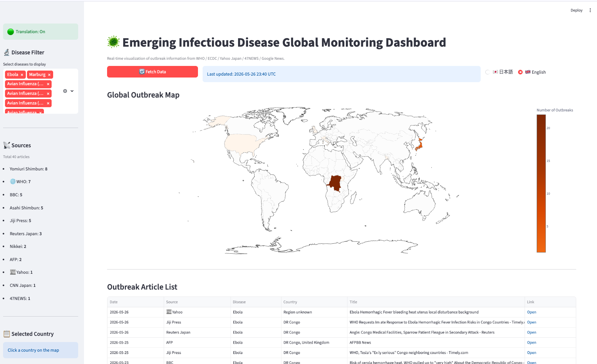

English | [日本語](README.ja.md)

# Emerging Infectious Disease Global Monitoring Dashboard

**Status**: Stable / in operation (v1.0). Core features are complete; active feature development is paused. Maintenance only (data-source upkeep and bug fixes) going forward.

A Streamlit application that visualizes WHO / ECDC outbreak information and Japanese news in real time on an interactive world choropleth map.



## Features

- **5 data sources** integrated in parallel: WHO DON, ECDC CDTR, Yahoo News Japan, Google News, NHK (Google News aggregates 47NEWS, major dailies, wire services)
- **Interactive world map** — click any country to see related articles in the sidebar
- **Disease filter** — 19 diseases including Ebola, Measles, Dengue, Hantavirus, Mpox, Cyclosporiasis and more
- **Source whitelist** — public broadcasters, national newspapers, wire services and government bodies only
- **Country extraction** — alias dictionary (80+ countries), multi-country articles, regional/unspecified fallback
- **Bilingual UI** — Japanese / English toggle; article titles translated locally via argos-translate (no API key needed)

## Data Sources

| Source | Description |
|--------|-------------|
| [WHO Disease Outbreak News (DON)](https://www.who.int/emergencies/disease-outbreak-news) | WHO official outbreak news |
| [ECDC CDTR](https://www.ecdc.europa.eu/en/publications-and-data/monitoring/weekly-threats-reports) | ECDC weekly communicable disease threat reports |
| [Yahoo Japan News](https://news.yahoo.co.jp/) | Major / international topics RSS |
| [Google News](https://news.google.com/) | Keyword-filtered Google News RSS (whitelisted sources only — incl. 47NEWS, major dailies, wire services) |

## Tech Stack

| | |
|---|---|
| **Language** | Python 3.11+ |
| **UI** | [Streamlit](https://streamlit.io/) |
| **Map** | [Plotly](https://plotly.com/python/) choropleth |
| **Package manager** | [uv](https://docs.astral.sh/uv/) |
| **Translation** | [argos-translate](https://github.com/argosopentech/argos-translate) (fully local) |
| **Country lookup** | [pycountry](https://pypi.org/project/pycountry/) |
| **Feed parsing** | [feedparser](https://pypi.org/project/feedparser/) |
| **HTML parsing** | [BeautifulSoup4](https://pypi.org/project/beautifulsoup4/) |

## Supported Platforms

| Platform | Core App | Translation |
|---|---|---|
| Apple Silicon Mac (M1/M2/M3/M4) | ✅ | ✅ |
| Intel Mac (x86_64) | ✅ | ❌ Not supported |
| Windows (x86_64 / ARM64) | ✅ | ✅ |
| Linux (x86_64 / ARM64) | ✅ | ✅ |

- The core features (world map, data fetching, disease filter, article display, etc.) work on all platforms.
- The Japanese/English translation feature is **not available on Intel Macs**, because onnxruntime (a dependency of the argos-translate library) does not provide a package for Intel macOS (x86_64). On Intel Macs, all features other than translation are available.
- All features are available on Apple Silicon Macs, Windows, and Linux.

## Setup

### Prerequisites

- Python 3.11 or later
- [uv](https://docs.astral.sh/uv/) package manager

### Installation

```bash
# Clone the repository
git clone <repository-url>
cd infectious-disease-monitor
```

With translation (Apple Silicon Mac / Windows / Linux):

```bash
uv sync --extra translation
```

Without translation (Intel Mac, or if translation is not needed):

```bash
uv sync
```

### Run

```bash
uv run streamlit run app.py
```

The app opens at `http://localhost:8501`. On first launch, outbreak data is fetched automatically.

> **Note:** If you installed with `--extra translation`, the Japanese ↔ English translation models (~50 MB each) are downloaded on first launch via argos-translate. An internet connection is required only for this one-time download; subsequent runs work fully offline. Without the translation extra, the UI language toggle still works but article titles are shown in their original language.

## Directory Structure

```
.
├── app.py                      # Streamlit entry point
├── src/
│   ├── fetchers/               # Data fetchers (WHO, ECDC, Yahoo, Google)
│   ├── parsers/                # Country extraction, disease filter, source whitelist
│   ├── data/                   # Glossary, UI labels, disease default countries, mock articles
│   ├── visualizers/            # Choropleth map builder
│   ├── translator.py           # argos-translate wrapper + cache
│   └── cache.py                # JSON cache management
└── data/
    └── cache/                  # Runtime cache — excluded from Git
```

## Country Inference (Provisional Setting)

Articles whose title contains no country, place, US state, or broad-scope marker can be
assigned a **default country per disease**, defined in `src/data/disease_defaults.py`.
Such articles are marked "(inferred)" in the UI and logged at INFO level.

| Disease | Default country | Reason |
|---------|-----------------|--------|
| Cyclosporiasis | USA | The 2026 lettuce-borne outbreak is centered on the United States |

> ⚠️ **This mapping is provisional and depends on the current outbreak situation.**
> If the affected region shifts, the inference becomes wrong. Review it periodically and
> delete the entry once the outbreak subsides — `DISEASE_DEFAULT_COUNTRY` is the only
> place that needs editing.

## Disclaimer

- This tool is intended for **information aggregation only** and must not be used as the basis for medical or public health decisions.
- Article titles and links are displayed for reference. Copyright of each article belongs to its respective publisher.
- Please respect each website's terms of service and avoid excessive automated access.
- Accuracy and completeness of the data are not guaranteed.

## Development

This project was developed with the help of [Claude Code](https://claude.ai/code) (Anthropic's AI coding assistant), using an AI pair-programming approach for everything from design decisions to implementation and debugging.

## License

[MIT](LICENSE)

## Changelog

### 2026-08-05 (3)
- Suppressed the misleading `WARNING no countries found` for articles that are subsequently resolved by a per-disease default country (`extract_countries()` now takes `log_unmatched`)
- Moved the inference log from the root logger to `src.parsers.country` (new `log_inferred_country()`), so it lands in `country_extraction.log` with the other country-detection logs
- The "(inferred)" marker now leads the country cell (`※(inferred) United States`) and the country column is widened, so the marker is never cut off in the article table

### 2026-08-05 (2)
- Added single-kanji country abbreviations (米/英/仏/独/豪/加/印/韓/露) → ISO3. Matched only when preceded by a non-kana/kanji character and followed by a particle (で・の・に・へ・は), so 「新米の」「欧米で」「訪米」「単独で」「増加の」 are not misread
- Titles ending in a '/'-separated photo-credit chain ('…/Melanie Moser/CDC/AP') are now cleaned in `clean_text()` before country extraction and display; stripping requires a known credit keyword and enough remaining text, so titles like 'A(H5N1)/A(H7N9)' are left intact
- Added per-disease default country inference (`src/data/disease_defaults.py`) applied only to otherwise-unknown articles; inferred articles carry `inferred=True`, are labelled "(inferred)" in the UI, and log `INFO inferred country … from disease default (…)`. Initial setting: Cyclosporiasis → USA (provisional — see "Country Inference")
- Result on a live fetch: unknown articles dropped from 20 to 14, USA-linked articles rose from 5 to 11

### 2026-08-05
- Added Cyclosporiasis as the 19th monitored disease (EN keywords: Cyclospora / Cyclosporiasis / Cyclospora cayetanensis, JA: サイクロスポラ); registered in the glossary and translator, plus JA/EN Google News queries
- Added US state names (50 states + District of Columbia) → USA mapping. Ambiguous names require an explicit state marker ("Washington state", "Georgia, US", 「ジョージア州」); Japanese names match only with the 「〜州」 suffix; two-letter abbreviations are not used
- Added Japanese ministry / institution / law / university markers (厚労省, 国立感染症研究所, 感染症法, 東大・阪大 …) → JPN, so domestic articles without a place name are no longer "unknown"
- Both mappings run only as a fallback after country-name matching, so "中国の厚生当局" stays CHN and "New Mexico" no longer resolves to Mexico

### 2026-06-01 (3)
- Marked project as v1.0 (stable / in operation); added status line below the title

### 2026-06-01 (2)
- Added Japan domestic place-name → JPN mapping (47 prefectures, 8 geographic regions, ~1,285 municipalities from a bundled JSON)
- Articles mentioning Japanese place names (e.g. "Chitose bird flu … Hokkaido report") are now correctly classified as `scope="country"` with `iso3_list=["JPN"]` and appear on the world map
- Collision guard: "中国地方" (Chūgoku region) is matched before "中国" (China), preventing false CHN mappings for western-Japan news
- Blocklist prevents ambiguous 1–2-char names (directions, common nouns, ward names) from being registered as JPN aliases

### 2026-06-01
- Articles with "Multi-country", "Multi-locations", "Worldwide", etc. in the title are now classified as `scope="broad"` instead of falling through to "unknown"
- Sidebar "Regional / Unspecified News" section split into two subsections: "Broad-scope News" (multi-country / global) and "Location Unknown" (no geographic signal)
- Suppressed false-positive `WARNING no countries found` for broad-scope articles; replaced with `INFO broad scope detected`

### 2026-05-31
- Removed the non-functional standalone 47NEWS fetcher (47NEWS articles are still collected via Google News); updated data source description accordingly
- Clean up HTML tags and source-name suffixes leaking into article titles (Google News, Yahoo, 47NEWS)
- Migrated deprecated `use_container_width` to the new `width` API (Streamlit)

### 2026-05-30 (latest)
- Fixed avian influenza subtype labels (H5N1/H7N9/H9N2) being indistinguishable in English mode (subtype now shown first: "H5N1 Avian Influenza")

### 2026-05-30 (prev latest)
- Use an English-UI screenshot in the English README

### 2026-05-30 (prev latest 5)
- Improved the disabled-translation badge (light orange background); added a help section explaining how to enable translation and the Intel Mac limitation

### 2026-05-30 (prev latest 4)
- Added a status badge in the sidebar showing whether translation is enabled

### 2026-05-30 (prev latest 3)
- Made translation an optional dependency so the app runs even without the translation library (e.g. on Intel Macs); split install instructions into with/without translation

### 2026-05-30 (prev latest 2)
- Added a Supported Platforms section; noted that the translation feature is unavailable on Intel Macs

### 2026-05-30 (prev latest)
- Added a note about the development process (built with Claude Code)
- Added About and How-to-Use expandable sections to the sidebar (bilingual, language-toggle aware)

### 2026-05-30 (patch 2)
- Fixed missing translation in article table title column (now uses same cache as sidebar)
- Localized news source names in sidebar (Yomiuri Shimbun, Nikkei, Jiji Press, etc.)
- Added `PUBLISHER_EN` dict and `localize_label()` to `source_whitelist.py`

### 2026-05-30 (patch 1)
- Extended language toggle to all UI areas: page title, subtitles, headings
- Disease filter options now switch language (Ebola, Measles, …); selection preserved across switches
- Map colorbar and hover tooltip localized
- Article table columns and data (country names, disease names) localized
- Introduced `glossary.py` and `ui_labels.py` for centralized i18n; added `get_country_name(iso3, lang)` to `country.py`

### 2026-05-30 (initial)
- Added Japanese / English language toggle
- Implemented fully local article title translation via argos-translate
- Disease and country name glossary to prevent mistranslations
- Translation result cache (`data/cache/translations.json`)

### 2026-05-25 (5th update)
- Strengthened country extraction (title + summary, alias dictionary expanded to 80+ countries)
- Multi-country articles now mapped to all matching countries
- Added "Regional / Unspecified News" section to sidebar
- Added country extraction accuracy log (`data/cache/country_extraction.log`)

### 2026-05-25 (4th update)
- Introduced source whitelist for Google News RSS (trusted sources only)
- Defined trusted sources: public broadcasters, national newspapers, wire services, government bodies, academia
- Domain-pattern matching for prefectural agencies (`*.lg.jp`) and academia (`*.ac.jp`, `*.edu`)
- Added source breakdown list to sidebar

### 2026-05-25
- Implemented real data fetching for WHO DON / ECDC CDTR (past 3 months, with cache)
- Expanded disease filter to 18 diseases (added Measles, Hantavirus)
- Disease multiselect UI added to sidebar
- Mock data fallback on fetch failure
- Improved choropleth color scale (better visibility at count=1)
- Added Yahoo Japan, 47NEWS, and Google News RSS as data sources (5 sources total)
- Parallel fetching with `ThreadPoolExecutor`; independent per-source error handling
- Japanese country name → ISO3 mapping (70+ countries)
- Source labels in article list (🌐 WHO / 🇪🇺 ECDC / 📰 Yahoo / 🗞 47NEWS / 🔍 Google)

### 2026-05-21
- Article links open in new tab (`target="_blank"`)
- "No data" message on click with no matching articles

### 2026-05-17
- Interactive world map click to select countries
- Selected country articles shown in sidebar
- Initial release (mock data choropleth)
